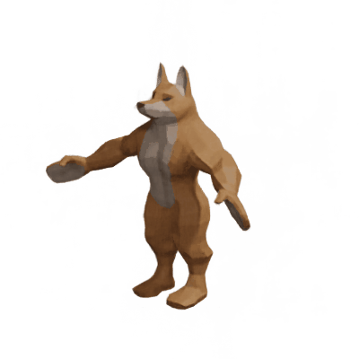
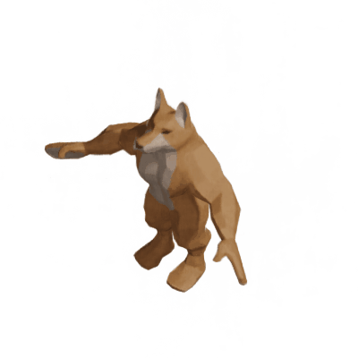
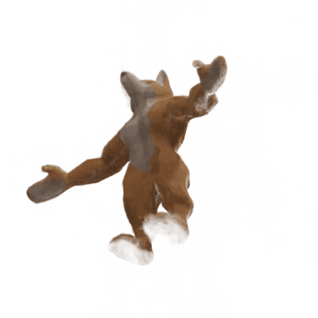

# NeRF from Scratch — 3D Reconstruction & Novel View Synthesis

Implementation of Neural Radiance Fields (NeRF) from scratch in Python/PyTorch, 
without relying on any existing NeRF library.

## Overview

This project explores 3D scene reconstruction and novel view synthesis from a set 
of 2D images. Given ~100 photographs of a humanoid fox character from different 
angles, the model learns an implicit volumetric representation of the scene and 
generates new viewpoints never seen during training.

## Architecture

- **dataset.py** — Ray generation from camera poses and intrinsics
- **models.py** — NeRF MLP with positional encoding + view-dependent color prediction
- **rendering.py** — Volumetric rendering with accumulated transmittance
- **ml_helper.py** — Training loop and PSNR evaluation
- **utils.py** — Mesh extraction via marching cubes
- **NERF_main.ipynb** — Main notebook: training, evaluation and novel view generation

## Key concepts implemented

- Positional encoding (Fourier features) for position and direction
- MLP with skip connections (two-block architecture)
- Volume rendering with alpha compositing
- Ray sampling between near/far bounds
- White background compositing

## Results

**3D Reconstruction**



**Novel View Synthesis**

 

## References 

Inspired by the course of [Maxime Vandegar](https://www.linkedin.com/in/maxime-vandegar/)

Dataset from the course: https://www.udemy.com/course/nerf-neural-radiance-fields-fr/

## Requirements

```
torch
numpy
imageio
tqdm
trimesh
mcubes
scikit-image
open3d
pymeshlab
Pillow
```
